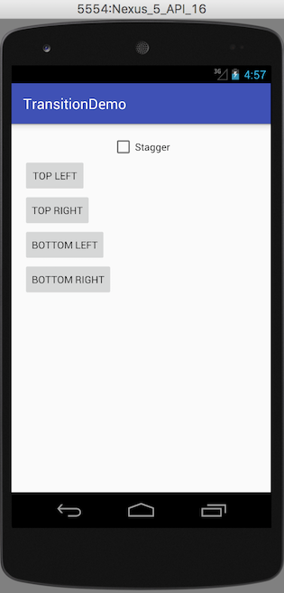

#Transitions

This application shows how to use the Transitions API in the Android Support
Library. While transitions have worked on the platform since the KitKat release
(API level 19), there was previously no way to use transitions on devices
running earlier releases. Now you can use the Support Library API instead to
run on Android releases back to Ice Cream Sandwich (API level 14).

Note that the Support Library APIs have the following limitations, compared
to transitions in the framework APIs:

* The Support Library API is specifically about view transitions, the same as
we offered in the KitKat release. Later capabilities such as Activity Transitions,
depend on platform capabilities that cannot be supported on earlier releases.
* KitKat transitions offer the ability to use XML resource files to define
transitions, scenes, and transition graphs. Support Library transitions, on
the other hand, only allow setting up transitions from code; there are no such
resource files available in the Support Library.

To use the transitions demo application:

* Click on one of the buttons to move the entire group of buttons to the
 location specified in the button text. Note how the buttons animate into
 place (via the single call to TransitionManager.beginDelayedTransition()).
* Check the "Stagger" checkbox to indicate whether the transitions should
run in a staggered fashion, one after the other. When this happens, the buttons
will start one at a time, by creating a custom TransitionSet of child
transitions with different target views and startDelays.

For more information on transitions, see the following resources:

* [Support Library versions](https://developer.android.com/topic/libraries/support-library/revisions.html)
(use version 24.2.0+ for the transitions API)
* [android.support.transitions](https://developer.android.com/reference/android/support/transition/package-summary.html)
reference documentation
* [Developer training on Transitions](https://developer.android.com/training/transitions/index.html)
